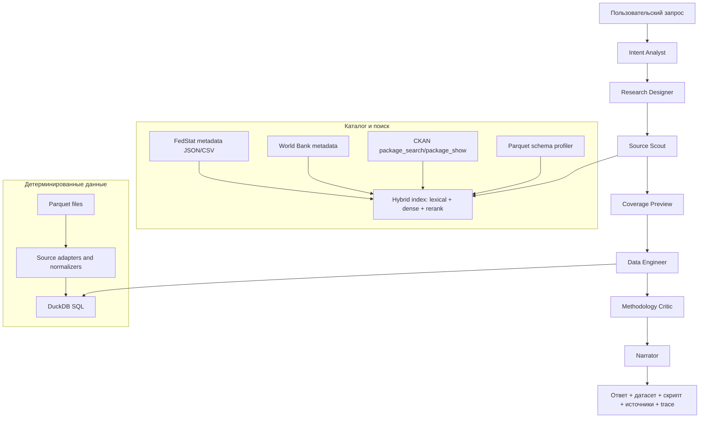

# Архитектура и технологический стек DataAgent

## Короткая позиция

Мы строим не чат-бота и не обычный RAG, а source-bound ассистента для экономических данных. По продуктовой логике он похож на NotebookLM: ассистент работает только в рамках найденных источников, показывает след рассуждений, честно отказывается при нехватке данных и не придумывает числа. Но в отличие от NotebookLM, основной объект здесь не текстовые документы, а структурированные статистические таблицы, метаданные, классификаторы, периоды, единицы измерения и воспроизводимые датасеты.

Ключевой принцип: LLM понимает запрос, проектирует исследование и выбирает источники, но факты и числа извлекаются детерминированным кодом из данных. Ответ без источника или без воспроизводимого способа получения числа считается ошибкой.

## Что мы учитываем из анализа данных

Основные рабочие источники для прототипа - данные Росстата/FedStat, данные World Bank из подготовленного экспорта и API репозитория НЦСЭД на CKAN. FedStat является самым сложным источником по формату и поэтому задает требования к нормализации. World Bank важен как второй большой экономический источник с десятками тысяч индикаторов и более регулярной структурой метаданных. Другие экономические источники используются как источник архитектурных паттернов: у экономических хранилищ часто есть коды индикаторов, неоднозначные названия, разная гранулярность времени, агрегаты, пропуски, разные единицы измерения и метаданные, которые нельзя считать полностью чистыми.

По FedStat уже видны критические особенности:

- данные лежат в Parquet, но многие таблицы имеют широкий формат;
- первая строка Parquet часто является фактическим заголовком измерений и годов;
- названия колонок могут быть техническими: `column00`, `column01`, `column0`;
- нормализованные `clean_jsonl` есть только для небольшой части показателей;
- общий `metadata.jsonl` не является полным каталогом;
- каталог нужно собирать из `metadata/*.json`, `metdata.csv`, Parquet-схем и CKAN;
- показатель может иметь несколько периодичностей: год, квартал, месяц, неделя;
- заявленный период в метаданных не всегда равен реально заполненному покрытию по выбранному срезу.

Вывод: качество решения определяется не размером контекста и не количеством агентов, а надежностью слоя нормализации, поиска по метаданным, проверки покрытия и детерминированного извлечения.

По World Bank полезны другие паттерны, которые нужно сохранить в архитектуре:

- большое число индикаторов требует поиска по названиям, кодам, темам и описаниям;
- одно и то же понятие может называться иначе, чем в пользовательском запросе;
- часть географий является агрегатами, а не странами;
- покрытие сильно отличается по индикаторам и странам;
- числовые данные чище, чем в FedStat, но источник требует строгого выбора индикатора, страны и периода;
- источник хорошо подходит для проверки универсальности retrieval и coverage-preview, даже если основной демонстрационный фокус будет на FedStat/НЦСЭД.

## Целевая схема



## Роли в workflow

Это не должны быть автономные агенты, которые спорят друг с другом. Надежнее реализовать роли как явные шаги state machine с Pydantic-артефактами. В интерфейсе это можно показывать как работу исследовательской команды, но внутри каждый шаг контролируем и тестируем.

Важно: архитектурно фиксируется не конкретная библиотека, а паттерн state machine. LangGraph - рекомендуемая реализация для максимального режима, потому что дает чекпойнты, возвраты и human-in-the-loop. Для хакатонного prototype mode допустим более легкий собственный orchestrator с теми же состояниями и схемами, если LangGraph начинает съедать время.

Главный принцип для всех ролей: structured but open-ended. Структура нужна для воспроизводимости, тестов и детерминированного извлечения, но она не должна превращаться в жесткую анкету. Каждый шаг хранит два слоя:

- `known_fields` - то, что уже можно формализовать и передать в код;
- `open_reasoning` - гипотезы, альтернативные трактовки, proxy-показатели, поисковые ветки и методологические сомнения.

Агент не обязан останавливать работу при каждом пропущенном поле. Если можно разумно продолжить через несколько поисковых веток и coverage-preview, он продолжает и явно показывает допущения.

### Intent Analyst

Преобразует естественный запрос не в жесткий набор полей, а в `IntentFrame`. Его задача - сохранить смысл запроса и выделить то, что уже известно.

Минимально структурирует:

- явные сущности: география, период, показатели, единицы, источники, если они названы;
- тип задачи: прямой поиск, сравнение, тренд, исследование, производная метрика, проверка отсутствия данных;
- недостающие поля, которые действительно мешают извлечению.

Оставляет открытым:

- цель пользователя своими словами;
- неявные экономические концепты;
- возможные proxy-показатели;
- альтернативные трактовки;
- поисковые расширения;
- критерий, когда надо спрашивать уточнение, а когда можно продолжать с допущениями.

### Research Designer

Главный слой вау-эффекта. Он не просто ищет показатель, а расширяет задачу как аналитик:

- формулирует исследовательскую гипотезу;
- предлагает контрольные переменные, если они нужны;
- предупреждает о возможной ложной интерпретации;
- выбирает нужную гранулярность;
- задает правила агрегации и сравнения;
- описывает, какой датасет должен получиться.

Research Designer не должен преждевременно сужать задачу до одного показателя. Его нормальное поведение - предложить несколько исследовательских веток, например основной показатель, proxy-показатели и контрольные переменные. Финальный выбор происходит только после Source Scout и Coverage Preview.

Пример: если пользователь просит "оценить связь зарплат и инфляции", система должна не только найти зарплату и CPI, но и предложить реальные зарплаты, базовый год индекса, периодичность, регионы и ограничения сравнения.

### Source Scout

Ищет кандидаты источников в локальном каталоге, World Bank-адаптере и CKAN. Здесь особенно опасен хардкод: нельзя искать только по одному `indicator_hint` или только по одному коду. Source Scout должен запускать несколько поисковых стратегий:

- точный поиск по коду и названию;
- лексический поиск по русским и английским словам;
- семантический поиск по описаниям и темам;
- поиск по proxy-показателям;
- поиск по методологическим словам;
- CKAN discovery для свежих или отсутствующих локально источников.

На выходе не сырой JSON, а компактные карточки источников:

- `source_id`;
- название;
- код индикатора;
- источник;
- единица измерения;
- периодичность;
- доступные измерения;
- ссылка на первоисточник;
- причина выбора;
- риски и ограничения.

Карточка источника должна иметь не только `why_matched`, но и `match_mode`: exact, lexical, semantic, proxy, ckan_discovery, methodology_match. Это защищает нас от ситуации, когда агент нашел релевантный источник нестандартным путем, но не может объяснить почему.

### Coverage Preview

Перед извлечением чисел проверяет, что данные реально есть. Здесь тоже нельзя хардкодить только "годы + география": для экономических данных покрытие зависит от периодичности, единиц, классификаторов, срезов, агрегатов и версии методологии.

- какие годы заполнены;
- какие периоды доступны;
- какие регионы/классификаторы есть;
- где пропуски;
- какие срезы лучше не использовать;
- какие альтернативы есть.

Coverage Preview должен возвращать не только verdict `enough/not_enough`, но и карту возможностей:

- лучший доступный срез;
- альтернативные срезы;
- компромиссы качества;
- что потеряется при выборе каждого среза;
- какие уточнения могли бы улучшить результат;
- можно ли продолжать без вопроса пользователю.

Это критично для FedStat, потому что метаданные могут обещать более широкий период, чем реально доступен в конкретном срезе.

### Data Engineer

Готовит воспроизводимое извлечение:

- нормализует широкий Parquet в long-формат;
- строит SQL или шаблон Python-скрипта;
- фильтрует по кодам, периодам, географии, классификаторам;
- сохраняет датасет и manifest;
- не дает LLM самой "читать числа глазами".

Data Engineer не должен быть свободным генератором произвольного кода. Но и здесь не нужен жесткий хардкод под один формат. Нужна библиотека безопасных операций:

- normalize wide FedStat table;
- read regular long Parquet;
- filter dimensions;
- aggregate by period/geography/category;
- join indicators;
- compute derived metric;
- rebase index;
- validate units and coverage.

LLM выбирает план операций, а не пишет весь pipeline с нуля. Это сохраняет гибкость без риска небезопасного или невоспроизводимого кода.

### Methodology Critic

Проверяет результат до финального ответа. Critic не должен быть списком запретов, иначе он будет только блокировать. Его задача - оценивать риск и предлагать лучший следующий шаг:

- совпадают ли единицы измерения;
- не смешаны ли месячные, квартальные и годовые периоды;
- не выбран ли агрегат вместо региона;
- не использованы ли пустые годы;
- есть ли достаточное покрытие для вывода;
- нужно ли честно отказаться или предложить альтернативу.

Выход Critic:

- `pass`;
- `pass_with_warnings`;
- `needs_repair`;
- `needs_user_clarification`;
- `not_found`.

Если проблема исправима автоматически, Critic должен предложить repair-plan, а не сразу требовать вопрос к пользователю.

### Narrator

Формирует понятный ответ. Narrator не должен иметь фиксированный шаблон для всех случаев: прямой lookup, исследовательская гипотеза и отказ из-за отсутствия данных требуют разной формы ответа.

- краткий вывод;
- таблица/график/датасет;
- ссылки на источники;
- объяснение методологии;
- блок "как я это нашел";
- список отвергнутых источников и причин.

Narrator выбирает форму ответа по типу задачи, но обязательные инварианты сохраняются: источники, воспроизводимость, ограничения и trace.

## Где нельзя хардкодить

Жесткие поля полезны только там, где дальше работает код. В исследовательском поиске они вредят, если становятся единственным способом думать.

Нельзя хардкодить:

- конечный список типов запросов как закрытую классификацию;
- единственный показатель на выходе Intent Analyst;
- единственную географию, если запрос допускает сравнение или агрегаты;
- один временной диапазон без альтернативы "последний доступный период";
- только точный поиск по названию индикатора;
- только один источник при наличии близких proxy;
- бинарный verdict coverage `есть/нет`;
- единый шаблон ответа для lookup, исследования и отказа.

Нужно хардкодить:

- формат артефактов;
- обязательность источников;
- запрет на числа из памяти LLM;
- проверку покрытия;
- manifest итогового датасета;
- лог выбранных и отвергнутых источников;
- ограничения безопасного исполнения кода.

Иными словами, свобода нужна в поиске, гипотезах и выборе веток. Строгость нужна в доказательствах, числах и воспроизводимости.

## Технологический стек

| Слой | Выбор | Почему |
|---|---|---|
| LLM | Qwen 3.6 через Yandex AI Studio | Модель фиксирована; используем ее для понимания запроса, планирования и структурированных артефактов |
| API LLM | OpenAI-compatible API / Yandex AI Studio SDK | Позволяет работать с Qwen через привычные клиенты, Responses API, tool-calling и response formatting |
| Yandex AI Studio native tools | Agents, File Search, MCP Hub, Vector Store API | Используем там, где они дают преимущество для хакатона Yandex Cloud: RAG по документам, подключение внешних API и демонстрация cloud-native интеграции |
| Structured output | Pydantic v2 | Все шаги возвращают проверяемые схемы, а не свободный текст |
| Workflow | State machine; LangGraph в maximum mode | Фиксируем явные состояния; LangGraph полезен для нелинейного пути, но не должен быть блокером первого рабочего прототипа |
| Табличный движок | DuckDB | Быстро читает Parquet, хорошо подходит под SQL, не требует отдельного сервера |
| Нормализация | PyArrow + source-specific adapters | FedStat требует wide-to-long; World Bank требует выбора индикаторов, географий, агрегатов и покрытия |
| Доп. обработка | Polars | Быстрые lazy-преобразования для больших таблиц, когда SQL неудобен |
| Метаданные | SQLite/DuckDB catalog | Локальный каталог источников, схем, покрытий и карточек индикаторов |
| Гибридный поиск | lexical BM25/FTS + dense embeddings | Экономические запросы требуют и точного поиска по кодам, и семантического поиска по смыслу |
| Векторное хранилище | Qdrant в production mode; локальный индекс в prototype mode | Qdrant хорош для фильтров и гибридного поиска, но для первого прототипа можно начать проще |
| Эмбеддинги | BAAI/bge-m3 или Yandex Text embeddings doc/query | bge-m3 силен для русского и гибридного поиска; Yandex embeddings проще в инфраструктуре |
| Reranker | bge-reranker-v2-m3 | Пересортировка top-k кандидатов перед передачей в Qwen снижает шум |
| Сессии | In-memory/file store на старте; PostgreSQL/LangGraph Checkpointer позже | Воспроизводимый журнал нужен обязательно, но Postgres не должен блокировать демо |
| Файлы | Локальный Parquet на старте; S3/Yandex Object Storage позже | Локально быстрее для демо; S3 нужен для внедряемой архитектуры |
| Code execution | Шаблонный SQL first; Docker sandbox позже | Сначала ограничиваем генерацию безопасными шаблонами, затем добавляем песочницу |
| UI | Streamlit | Быстрый интерфейс с чатом, артефактами, trace и coverage-preview |
| API сервиса | FastAPI как следующий слой | Нужен для внешней API-ручки и отделения UI от backend |
| Логи | loguru + structured events | Trace ассистента должен быть продуктовой функцией, а не внутренним логом |
| Оценка качества | pytest + golden eval cases | Проверяем retrieval, покрытие, отказ, SQL и финальные ответы на фиксированных кейсах |

## Почему этот стек подходит именно под Qwen 3.6

Qwen 3.6 достаточно сильна для понимания экономических запросов, декомпозиции задачи и генерации структурированных планов. Но мы не должны заставлять ее делать то, где LLM системно ошибаются: вспоминать числа, удерживать огромные каталоги в контексте, разбирать миллионы строк и самостоятельно проверять покрытие.

Поэтому стек снимает с модели лишнюю нагрузку:

- Pydantic фиксирует формат;
- hybrid retrieval дает короткий список хороших кандидатов;
- reranker убирает шум перед финальным выбором;
- Coverage Preview проверяет реальные данные до ответа;
- DuckDB извлекает числа;
- Methodology Critic ловит методологические ошибки;
- trace делает работу прозрачной для пользователя и жюри.

## Retrieval без засорения контекста

CKAN содержит много наборов данных, поэтому нельзя передавать ответы API напрямую в LLM. Вместо этого используется сжатый контекст.

Правильный поток:

1. Нормализовать запрос.
2. Выполнить `package_search` с малым `rows`.
3. Преобразовать результаты в `SourceCandidateCard`.
4. Локально пересортировать кандидатов.
5. Вызвать `package_show` только для top-3/top-5.
6. Отдать Qwen только короткий `EvidenceBundle`.
7. Сырые данные держать вне контекстного окна.

Пример карточки:

```json
{
  "source_id": "emiss_57319",
  "title": "Валовой внутренний продукт в рыночных ценах...",
  "indicator_code": "57319",
  "source": "FedStat / CKAN",
  "formats": ["parquet", "csv.gz", "xls.zip"],
  "periodicity": ["annual", "quarterly"],
  "dimensions": ["price_type", "okato", "unit", "period"],
  "provenance_url": "https://www.fedstat.ru/indicator/57319",
  "why_matched": "Запрос связан с ВВП; название и код совпадают с экономическим показателем",
  "risk_flags": ["нужно выбрать вид цены", "годовое покрытие отличается от квартального"]
}
```

## Использование Yandex AI Studio

Так как проект делается в контексте НЦСЭД + Yandex Cloud, игнорировать native-возможности AI Studio неправильно. Но использовать их нужно не вместо собственного data engine, а как внешний слой интеграции.

По документации Yandex AI Studio поддерживает AI agents с function calling, response formatting, web/file search, Vector Store API и MCP Hub. Это хорошо ложится на наш продукт, но роли должны быть разделены:

- Yandex AI Studio/Qwen 3.6 отвечает за понимание запроса, structured output, маршрутизацию и объяснение;
- File Search подходит для проектного брифа, методологических документов, README, описаний источников и пользовательских PDF/PPTX;
- Vector Store API может хранить текстовые knowledge-base материалы, но не заменяет наш индекс статистических индикаторов;
- MCP Hub подходит для подключения CKAN, внутреннего catalog API, источников НЦСЭД и вспомогательных сервисов;
- AI Studio Agents можно использовать как внешний agent shell, но data extraction остается в наших deterministic tools.

Неправильное использование: загрузить все Parquet/CKAN-ответы в File Search и ждать качественных числовых ответов. Это снова приведет к контекстному шуму и галлюцинациям.

Правильное использование: AI Studio Agent вызывает наши инструменты:

```text
search_catalog(query) -> SourceCandidateCard[]
preview_coverage(source_id, filters) -> CoverageReport
run_dataset_query(extraction_plan) -> DatasetArtifact
explain_methodology(artifact_id) -> MethodologyNote
```

Так мы демонстрируем cloud-native Yandex-интеграцию, но сохраняем надежность и воспроизводимость.

Официальные точки опоры:

- [AI agents in Yandex AI Studio](https://yandex.cloud/en/docs/ai-studio/concepts/agents/)
- [Text-based agents and File Search](https://yandex.cloud/en/docs/ai-studio/concepts/agents/text-agents)
- [MCP Hub in Yandex AI Studio](https://yandex.cloud/en/docs/ai-studio/concepts/mcp-hub/)

## Нормализация FedStat

FedStat-normalizer является обязательным компонентом. Его задача - превратить разные широкие таблицы в единый long-формат:

```text
indicator_code
indicator_name
source
dimension_name_1
dimension_value_1
dimension_name_2
dimension_value_2
...
period_type
period_label
year
value
unit
source_url
extracted_at
```

Нормализатор должен:

- читать первую строку как фактическую схему;
- определять year-columns;
- отделять измерения от временных колонок;
- чистить коды и названия классификаторов;
- сохранять исходные значения измерений;
- не разворачивать огромные таблицы полностью без фильтров;
- уметь делать preview покрытия до полной сборки.

## Адаптер World Bank

World Bank не должен исчезать из архитектуры: в требованиях это отдельный крупный источник с большим числом индикаторов. При этом его обработка отличается от FedStat.

WB-adapter должен:

- строить карточки индикаторов из кода, названия, темы, описания и источника;
- различать страны и агрегаты;
- хранить карту географий и aliases;
- проверять покрытие по индикатору, стране и периоду;
- не смешивать реальные страны с агрегированными группами без явного разрешения;
- отдавать данные в тот же канонический long-формат, что и FedStat.

Канонический формат должен быть общим для всех источников:

```text
source
dataset_id
indicator_id
indicator_name
geo_id
geo_name
geo_type
period
period_type
value
unit
dimensions
source_url
retrieved_at
quality_flags
```

Это позволяет Research Designer и Methodology Critic работать одинаково с FedStat, World Bank и CKAN-источниками.

## Оркестрация: state machine first

Главное решение - явные состояния и артефакты, а не конкретная библиотека.

В prototype mode можно реализовать workflow обычным Python-классом:

```text
IntentArtifact
ResearchDesignArtifact
SourceCandidatesArtifact
CoverageReport
ExtractionPlan
DatasetArtifact
CritiqueReport
FinalAnswer
```

LangGraph подключается, когда нужны:

- checkpointing;
- возвраты на предыдущие шаги;
- human-in-the-loop;
- replay сессий;
- ветвление workflow;
- более чистая демонстрация архитектуры.

Так мы снимаем риск overhead для хакатона, но не отказываемся от LangGraph как от сильного maximum-mode решения.

## Source Rejection Log

Для доверия важны не только выбранные источники, но и отвергнутые. Каждый отказ фиксируется структурно:

```json
{
  "candidate_id": "emiss_xxxxx",
  "title": "Название набора",
  "rejection_reason": "Показатель похож по названию, но имеет другую единицу измерения",
  "severity": "medium",
  "alternative_used": "emiss_yyyyy"
}
```

Это дает продуктовый вау-эффект: пользователь видит, что ассистент не просто нашел первый похожий набор, а провел отбор как аналитик.

## Режимы реализации

### Prototype mode

Цель - быстро получить работающий end-to-end продукт.

Используем:

- Qwen 3.6;
- Streamlit;
- Pydantic;
- легкий state-machine orchestrator или LangGraph, если он не тормозит разработку;
- DuckDB;
- PyArrow;
- SQLite/DuckDB catalog;
- локальный lexical search;
- простой dense index или Yandex embeddings;
- шаблонные SQL-запросы;
- локальные Parquet-файлы;
- FedStat adapter;
- World Bank adapter;
- CKAN client с context compression;
- Yandex AI Studio File Search для документов и брифа, если это ускоряет демонстрацию.

LangGraph, Qdrant, Docker sandbox, S3 и PostgreSQL можно заложить интерфейсами, но не делать блокерами первого запуска.

### Maximum mode

Цель - показать архитектуру уровня внедряемого продукта.

Добавляем:

- LangGraph checkpointed workflow;
- Qdrant hybrid search;
- bge-m3 embeddings;
- bge-reranker-v2-m3;
- PostgreSQL checkpointer;
- Docker sandbox с AST-проверкой;
- S3/Yandex Object Storage;
- FastAPI backend;
- AI Studio Agent shell;
- MCP Hub adapter для CKAN/каталога;
- Vector Store/File Search для методологических документов;
- golden eval dashboard;
- воспроизводимый session replay.

## Минимальный набор модулей в репозитории

Рекомендуемая структура:

```text
app/
  ui/
    streamlit_app.py
  workflow/
    graph.py
    states.py
    nodes/
      intent.py
      research_design.py
      source_scout.py
      coverage.py
      data_engineer.py
      critic.py
      narrator.py
  retrieval/
    catalog_builder.py
    lexical.py
    embeddings.py
    reranker.py
    ckan_client.py
    yandex_file_search.py
  data/
    fedstat_normalizer.py
    wb_adapter.py
    parquet_profiler.py
    duckdb_runner.py
    schemas.py
  artifacts/
    manifest.py
    exporters.py
  safety/
    ast_guard.py
    sandbox.py
  evals/
    golden_cases.yaml
    run_eval.py
```

## Что является главным отличием решения

Обычный RAG отвечает: "я нашел похожий текст и пересказал его".

Наш агент отвечает иначе:

1. Я понял исследовательскую задачу.
2. Я расширил ее до корректного экономического дизайна.
3. Я нашел несколько возможных источников.
4. Я проверил покрытие и отверг неподходящие.
5. Я извлек числа воспроизводимым SQL/кодом.
6. Я проверил методологические риски.
7. Я отдал датасет, скрипт, источники и объяснение.

Именно это должно быть центральным сообщением презентации и README: система думает как data-аналитик, но действует как воспроизводимый data pipeline.

## Финальное решение по стеку

Базовый стек:

```text
Qwen 3.6 via Yandex AI Studio
State machine orchestrator
LangGraph-ready workflow
Pydantic v2
DuckDB
PyArrow
Polars
SQLite/DuckDB catalog
FedStat adapter
World Bank adapter
CKAN compressed client
Streamlit
FastAPI-ready service layer
pytest golden evals
```

Расширенный стек для максимального уровня:

```text
Qdrant
BAAI/bge-m3
bge-reranker-v2-m3
PostgreSQL checkpointer
Docker sandbox + AST guard
Yandex Object Storage / S3
FastAPI
Yandex AI Studio Agents
Yandex AI Studio File Search / Vector Store API
MCP Hub
session replay dashboard
```

Приоритет реализации: сначала надежные source adapters and deterministic extraction, затем retrieval quality, затем trace/UX, затем LangGraph checkpointing и production-компоненты.
