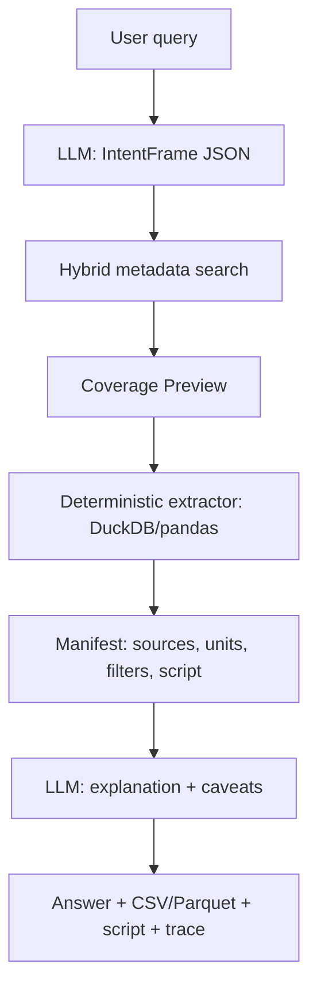

# Yandex AI Studio: что использовать в DataAgent

Дата: 2026-05-09

## Вывод для проекта

Для DataAgent стоит использовать Yandex AI Studio как LLM-слой и агентную оболочку, но не отдавать модели извлечение чисел. Оптимальный паттерн:

1. LLM формализует запрос экономиста в структурированный артефакт.
2. Retrieval ищет релевантные метаданные и источники.
3. Детерминированный код на DuckDB/pandas извлекает числа из Parquet/API.
4. LLM объясняет результат, методологию, ограничения и trace.

Это совпадает с текущим принципом проекта: "цифры только из данных, не из памяти LLM".

## Основные возможности AI Studio

AI Studio - платформа Yandex Cloud для AI-приложений и агентов на базе генеративных моделей. В ней есть:

- Model Gallery: текстовые, мультимодальные, embedding, classification и image-модели.
- AI Playground: ручные эксперименты с промптами.
- Agent Atelier: создание агентов в интерфейсе.
- OpenAI-compatible APIs и Yandex AI Studio SDK для интеграции.
- Responses API для текстовых агентов.
- Chat Completions API для обычных запросов к LLM.
- Files API и Vector Store API для RAG по файлам.
- Embeddings API для семантического поиска.
- Web Search Tool и File Search Tool.
- MCP Hub для подключения внешних API и инструментов.
- Code Interpreter для Python-задач в sandbox.
- LoRA fine-tuning, batch processing, dedicated instances.

## Как использовать LLM

### Проверенная рабочая связка проекта

Smoke test 2026-05-09 прошел успешно:

- endpoint: `https://llm.api.cloud.yandex.net/v1/chat/completions`
- model: `gpt://b1gbntotj1b57karq6qm/deepseek-v32/latest`
- auth header: `Authorization: Api-Key <YANDEX_API_KEY>`
- ответ модели: "Да, API работает корректно."

Секретный API key не фиксируется в репозитории. Его нужно передавать через переменную окружения `YANDEX_API_KEY` или локальный `.env`, который не коммитится.

Важная особенность: folder id в URI модели должен совпадать с folder id сервисного аккаунта API-ключа. При несовпадении Yandex возвращает `permission_error`, например `Specified folder ID ... does not match with service account folder ID ...`.

Минимальный проверенный REST-запрос:

```bash
curl -sS -X POST "https://llm.api.cloud.yandex.net/v1/chat/completions" \
  -H "Authorization: Api-Key ${YANDEX_API_KEY}" \
  -H "Content-Type: application/json" \
  -d '{
    "model": "gpt://b1gbntotj1b57karq6qm/deepseek-v32/latest",
    "messages": [
      {"role": "user", "content": "API работает? Ответь одним коротким предложением."}
    ],
    "max_tokens": 80,
    "reasoning_effort": "none"
  }'
```

### Вариант 1: Responses API

Рекомендуемый вариант для агента. Responses API объединяет генерацию текста, reasoning, tool calls и structured output. Документация прямо описывает его как API для создания текстовых агентов, RAG-сценариев, вызова инструментов и многоагентных систем.

Для DataAgent это подходит лучше всего:

- Intent Analyst: structured output в JSON/Pydantic-схему.
- Source Scout: function calling к локальному поиску по каталогу.
- Coverage Preview: function calling к проверке покрытия.
- Data Engineer: tool call к безопасному коду извлечения.
- Narrator: финальная текстовая сборка с источниками.

### Вариант 2: Chat Completions API

Подходит для простых LLM-вызовов без управления диалоговой памятью:

- классификация запроса;
- нормализация формулировок;
- генерация JSON по схеме;
- маленькие одношаговые задачи.

API поддерживает `response_format` с `json_schema`, streaming и tool/function calling. В документации Yandex для новых проектов рекомендуется пробовать Responses API.

### Минимальный Python-паттерн через OpenAI SDK

```python
from openai import OpenAI

client = OpenAI(
    api_key=os.environ["YANDEX_API_KEY"],
    base_url="https://llm.api.cloud.yandex.net/v1",
    project=os.environ["YANDEX_FOLDER_ID"],
)

response = client.chat.completions.create(
    model=f"gpt://{os.environ['YANDEX_FOLDER_ID']}/yandexgpt/rc",
    messages=[
        {"role": "system", "content": "Верни строго JSON по схеме."},
        {"role": "user", "content": "Найди данные по инфляции России."},
    ],
    response_format={
        "type": "json_schema",
        "json_schema": {
            "name": "intent_frame",
            "schema": {
                "type": "object",
                "properties": {
                    "metric": {"type": "string"},
                    "geo": {"type": "string"},
                    "period": {"type": "string"},
                    "needs_clarification": {"type": "boolean"},
                },
                "required": ["metric", "geo", "period", "needs_clarification"],
            },
        },
    },
)
```

В документации встречаются оба хоста: `https://llm.api.cloud.yandex.net/v1` в OpenAI SDK-примерах и `https://ai.api.cloud.yandex.net/v1/...` в REST API reference. Для OpenAI SDK начинать стоит с варианта из OpenAI-compatible примеров; для прямых REST-вызовов - с endpoint из конкретного API reference.

## Модели

По документации и Model Gallery релевантные варианты:

- YandexGPT Lite: быстрые простые задачи, классификация, форматирование, краткие summary.
- YandexGPT Pro: RAG, анализ документов, отчеты, извлечение данных, автозаполнение полей.
- Alice AI LLM: диалоговые ассистенты, работа с длинным контекстом.
- Qwen3 235B: агентные сценарии, сложные инструкции, поиск и суммаризация по документации.
- DeepSeek V3.2: reasoning, код, агентные сценарии, многошаговые задачи.
- Qwen/Gemma/OSS и другие open-source модели: доступны в Model Gallery/Batch/Dedicated режимах в зависимости от сценария.

Для MVP:

- основной LLM для первого прототипа: DeepSeek 3.2, потому что доступ уже проверен через AI Studio;
- альтернативы для benchmark: Qwen3 или YandexGPT Pro, если они доступны в аккаунте;
- быстрые служебные шаги: YandexGPT Lite;
- кодовые/агентные эксперименты: DeepSeek V3.2 или Qwen3;
- обязательный benchmark на 5-8 тест-кейсах, потому что качество structured output и tool calling важнее имени модели.

## Embeddings

AI Studio предоставляет две базовые embedding-модели:

- `emb://<folder_id>/text-search-doc/latest` - для больших текстов/документов;
- `emb://<folder_id>/text-search-query/latest` - для коротких запросов.

Размерность базовых embedding-векторов в документации: 256.

Для использования нужна роль `ai.languageModels.user` или выше на каталог. Для OpenAI-compatible embeddings нужен API key со scope `yc.ai.foundationModels.execute`.

Минимальный паттерн:

```python
from openai import OpenAI

client = OpenAI(
    api_key=os.environ["YANDEX_API_KEY"],
    base_url="https://llm.api.cloud.yandex.net/v1",
    project=os.environ["YANDEX_FOLDER_ID"],
)

doc_emb = client.embeddings.create(
    model=f"emb://{os.environ['YANDEX_FOLDER_ID']}/text-search-doc/latest",
    input="Описание показателя Росстата: индекс потребительских цен...",
    encoding_format="float",
)

query_emb = client.embeddings.create(
    model=f"emb://{os.environ['YANDEX_FOLDER_ID']}/text-search-query/latest",
    input="инфляция в России по годам",
    encoding_format="float",
)
```

Для нашего проекта embeddings нужны не по таблицам целиком, а по карточкам источников:

- название показателя;
- описание;
- источник;
- единица измерения;
- периодичность;
- география;
- методологические примечания;
- примеры колонок/измерений.

Такой индекс должен быть гибридным: BM25/FTS + embeddings + rerank/coverage preview. Только vector search будет ошибаться на кодах, аббревиатурах и точных названиях индикаторов.

## File Search и Vector Store

AI Search в AI Studio дает File Search и Web Search. File Search работает через загрузку файлов и создание Vector Store search index. AI Studio может автоматически разбивать файлы на chunks, но можно загрузить заранее подготовленные JSONL chunks; один chunk - до 8000 символов.

Для DataAgent это полезно для:

- документации источников;
- методологических описаний;
- README/справок;
- компактных metadata cards.

Осторожно: File Search не должен быть единственным механизмом поиска по статистическим данным. Табличные значения нужно извлекать локальным кодом.

## MCP Hub и tools

MCP Hub позволяет подключать MCP-серверы к агентам для доступа к внешним API и внутренним системам. Один MCP-сервер может содержать до 50 инструментов. Поддерживаются современные Streamable HTTP и устаревший HTTP with SSE.

Для проекта имеет смысл сделать MCP/tools слой:

- `search_sources(query, filters)` - поиск по локальному каталогу FedStat/World Bank/CKAN.
- `get_source_card(source_id)` - карточка источника.
- `preview_coverage(source_id, dimensions)` - реальное покрытие.
- `extract_dataset(plan)` - DuckDB/pandas извлечение.
- `compute_metric(plan)` - производные метрики.
- `save_artifacts(dataset, script, manifest)` - сохранение CSV/Parquet/script/manifest.

Это можно реализовать сначала как локальные Python functions в своем agent loop, а уже затем завернуть в MCP, если понадобится демонстрация AI Studio-native агентности.

## Code Interpreter

Code Interpreter в AI Studio позволяет агенту писать, запускать и отлаживать Python в виртуальном sandbox, работать с файлами и визуализациями. Для DataAgent это полезно для демонстраций и data validation, но для MVP безопаснее держать детерминированный extractor в нашем коде: LLM выбирает операцию и параметры, а не пишет произвольный pipeline с нуля.

## Fine-tuning

AI Studio поддерживает LoRA-based fine-tuning, включая tuning embedding-модели. Для MVP fine-tuning лучше не делать:

- мало времени;
- главная проблема - retrieval/coverage/extraction, а не стиль ответа;
- можно добиться большего качеством metadata cards и тест-кейсами.

Когда вернуться:

- если модель плохо понимает экономические формулировки;
- если много повторяющихся ошибок in intent extraction;
- если embedding плохо ищет по русским экономическим терминам.

## Auth и доступы

Нужно:

- Yandex Cloud folder ID.
- API key для service account.
- Роль `ai.languageModels.user` или выше для LLM/embeddings.
- Scope API key: `yc.ai.foundationModels.execute`.
- Для MCP Hub: `serverless.mcpGateways.invoker`; для внешних/template MCP дополнительно `serverless.mcpGateways.anonymousInvoker`; для создания MCP server - `serverless.mcpGateways.editor`.

Переменные окружения:

```bash
export YANDEX_API_KEY="..."
export YANDEX_FOLDER_ID="..."
```

## Рекомендованная архитектура MVP



Практический порядок:

1. Поднять OpenAI-compatible client.
2. Сделать один structured-output вызов для `IntentFrame`.
3. Сделать embedding/BM25 индекс metadata cards.
4. Подключить tools/function calling к локальным функциям.
5. Ограничить Data Engineer фиксированными операциями.
6. Прогнать 5-8 тест-кейсов на нескольких моделях.
7. Только потом решать, нужен ли AI Studio File Search, MCP Hub или fine-tuning.

## Источники

- About Yandex Cloud AI Studio: https://aistudio.yandex.ru/docs/en/ai-studio/concepts/
- API overview: https://aistudio.yandex.ru/docs/en/ai-studio/concepts/api.html
- AI agents: https://aistudio.yandex.ru/docs/en/ai-studio/concepts/agents/
- AI Search overview: https://aistudio.yandex.ru/docs/en/ai-studio/concepts/search/
- Responses API reference: https://aistudio.yandex.ru/docs/ru/ai-studio/responses/
- Chat Completions API reference: https://aistudio.yandex.ru/docs/en/ai-studio/chat/createChatCompletion.html
- Structured output guide: https://aistudio.yandex.ru/docs/en/ai-studio/operations/generation/completions-structured.html
- Embeddings guide via OpenAI API: https://aistudio.yandex.ru/docs/en/ai-studio/operations/embeddings/search-openai
- Embedding models: https://aistudio.yandex.ru/docs/ru/ai-studio/concepts/embeddings
- MCP Hub: https://aistudio.yandex.ru/docs/ru/ai-studio/concepts/mcp-hub/
- Model Gallery: https://aistudio.yandex.ru/en/model-gallery
